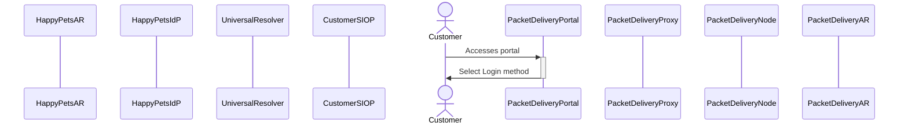
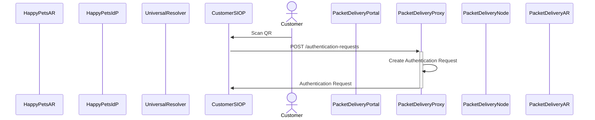

# HappyPets customer changes PTA using packet Delivery portal

## Customer access the web portal of Packet Delivery

The customer accesses the Packet Delivery Portal and the portal presents the customer the option to "Login with Credential". The portal presents a QR code.

The Happy Pets customer accesses the Packet delivery company web portal or starts the Packet Delivery company app in its smartphone.
Happy Pets customer gets forwarded to a page for selecting the desired Identity Provider for login. One of the login options is “Verifiable Credentials” or something similar.
Happy Pets customer selects the “Verifiable Credentials” login method, which causes the Packet delivery company portal to generate a QR containing inside the URL of the /authentication-requests endpoint of the Packet Delivery company IDP.
The customer scans the QR with her mobile and the mobile calls the /authentication-requests endpoint.

## Customer scans QR and initiates Authentication Request flow

The customer scans the QR code with the mobile and the wallet application invokes the endpoint that is specified by the QR code and this starts the Authentication Request flow.
The endpoint 

