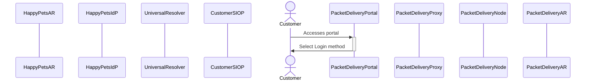
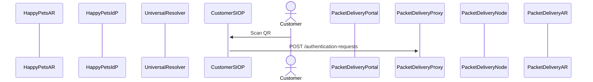

# HappyPets customer changes PTA using packet Delivery portal

## Customer access the web portal of Packet Delivery

The customer accesses the Packet Delivery Portal and the portal presents the customer the option to "Login with Credential". The portal presents a QR code.

## Customer scans QR and initiates Authentication Request flow

